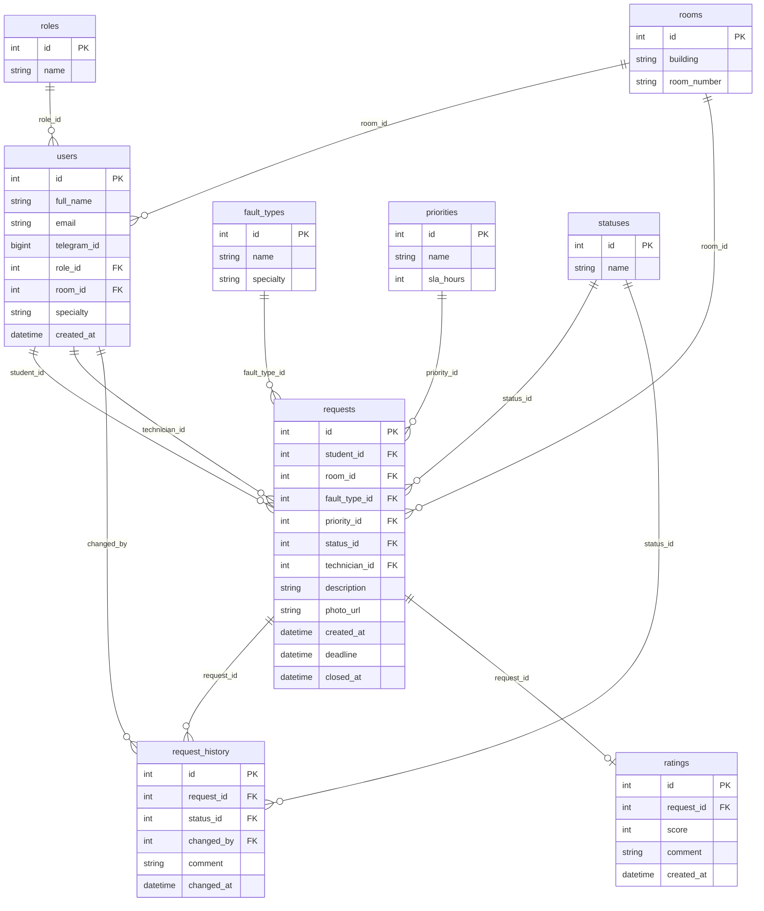

# ER диаграммасы

```mermaid
erDiagram
    roles ||--o{ users : "role_id"
    rooms ||--o{ users : "room_id"
    users ||--o{ requests : "student_id"
    users ||--o{ requests : "technician_id"
    rooms ||--o{ requests : "room_id"
    fault_types ||--o{ requests : "fault_type_id"
    priorities ||--o{ requests : "priority_id"
    statuses ||--o{ requests : "status_id"
    requests ||--o{ request_history : "request_id"
    statuses ||--o{ request_history : "status_id"
    users ||--o{ request_history : "changed_by"
    requests ||--o| ratings : "request_id"

    roles {
        int id PK
        string name
    }
    rooms {
        int id PK
        string building
        string room_number
    }
    users {
        int id PK
        string full_name
        string email
        bigint telegram_id
        int role_id FK
        int room_id FK
        string specialty
        datetime created_at
    }
    fault_types {
        int id PK
        string name
        string specialty
    }
    priorities {
        int id PK
        string name
        int sla_hours
    }
    statuses {
        int id PK
        string name
    }
    requests {
        int id PK
        int student_id FK
        int room_id FK
        int fault_type_id FK
        int priority_id FK
        int status_id FK
        int technician_id FK
        string description
        string photo_url
        datetime created_at
        datetime deadline
        datetime closed_at
    }
    request_history {
        int id PK
        int request_id FK
        int status_id FK
        int changed_by FK
        string comment
        datetime changed_at
    }
    ratings {
        int id PK
        int request_id FK
        int score
        string comment
        datetime created_at
    }
```